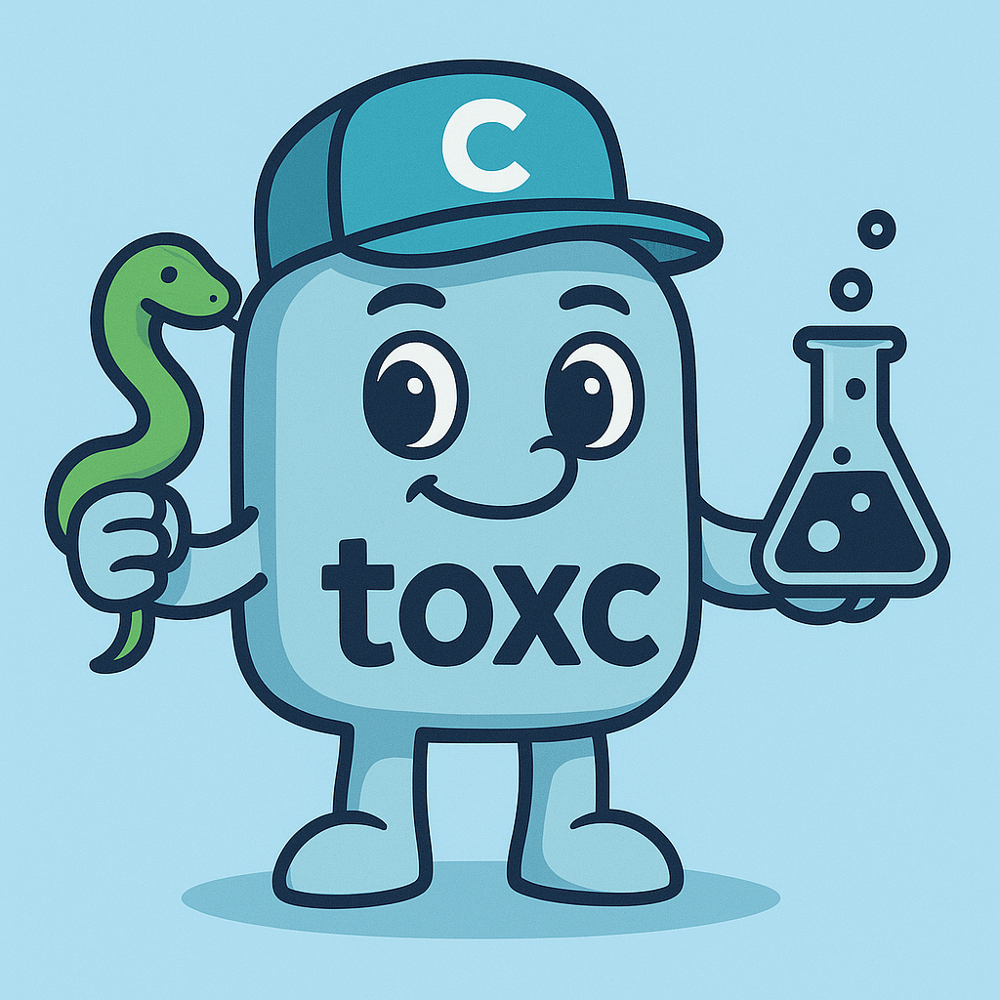

# toxc
<style>
table {
  width: 100% !important;
  max-width: 100% !important;
}
</style>
<div align="center">

[](https://opensource.org/licenses/MIT)
[](https://www.gnu.org/software/bash/)
[](https://github.com/bud003/toxc)



**A powerful Bash script that simplifies running [tox](https://tox.readthedocs.io/) tests across multiple conda environments**

*Enhanced with parallel execution, automatic environment management, and robust error handling*

</div>

---

## 🚀 Quick Start

```bash
# 1. Navigate to your Python project
cd /path/to/your/python/project

# 2. Download and make executable
curl -O https://raw.githubusercontent.com/bud003/toxc/main/toxc.sh && chmod +x toxc.sh

# 3. Run tests across all environments
./toxc.sh

# 4. Run tests in parallel
./toxc.sh --parallel
```

---

## 📋 Table of Contents

<details>
<summary>Click to expand</summary>

- 🔍 [Overview](#-overview)
- ✨ [Features](#-features)
- 📋 [Prerequisites](#-prerequisites)
- ⚡ [Installation](#-installation)
- 🎯 [Usage](#-usage)
  - [Command Syntax](#command-syntax)
  - [Options Reference](#options-reference)
  - [Arguments](#arguments)
  - [Environment Variables](#environment-variables)
- 💡 [Examples](#-examples)
- ⚙️ [Configuration](#️-configuration)
- 🔧 [Environment Management](#-environment-management)
- 🛡️ [Error Handling](#️-error-handling)
- 🔍 [Troubleshooting](#-troubleshooting)
- 🎓 [Advanced Usage](#-advanced-usage)
- 🤝 [Contributing](#-contributing)
- 📄 [License](#-license)

</details>

---

## 🔍 Overview

**toxc** bridges the gap between conda environment management and tox testing frameworks. It automates the creation and management of conda environments for your Python versions, installs tox within those environments, and executes your tests with full parallel execution support.

### 🎯 Why Choose toxc?

| Feature                                 | Benefit                                                                   |
| --------------------------------------- | ------------------------------------------------------------------------- |
| 🤖 **Automated Environment Management** | Creates conda environments for specified Python versions automatically    |
| ⚡ **Parallel Test Execution**           | Run tests across multiple Python environments simultaneously              |
| 🛡️ **Robust Error Handling**            | Comprehensive validation and graceful error recovery                      |
| 🔧 **Flexible Configuration**           | Extensive customization through CLI options and environment variables     |
| 🏭 **Production Ready**                 | Built with strict bash practices, signal handling, and cleanup procedures |

---

## ✨ Features

| 🔧 Core Features                             | 🛡️ Quality Features                      |
| -------------------------------------------- | --------------------------------------- |
| ✅ Automatic conda environment creation      | ✅ Comprehensive logging with colors     |
| ✅ Parallel test execution with job limits   | ✅ Signal handling and graceful shutdown |
| ✅ Environment auto-discovery from `tox.ini` | ✅ Input validation and error handling   |
| ✅ Force recreation of environments          | ✅ Cross-platform compatibility          |
| ✅ Dry run mode for previewing actions       | ✅ CI/CD integration ready               |

---

## 📋 Prerequisites

### ⚡ Required Dependencies

| Dependency | Minimum Version | Installation Check |
|------------|----------------|-------------------|
| **Conda** | Any (Anaconda/Miniconda) | `conda --version && conda info` |
| **Bash** | 4.0+ | `bash --version` |

### 🔧 Optional Dependencies

- **tox**: Auto-installed in conda environments if missing
- **Python**: Various versions installed automatically in conda environments

### 💻 System Requirements

- **Platforms**: Linux, macOS, or Windows with WSL
- **Storage**: At least 1GB free disk space for conda environments
- **Network**: Internet connection for downloading Python packages

---

## ⚡ Installation

### 🎯 Recommended: Direct Download

```bash
# Download and make executable
curl -O https://raw.githubusercontent.com/bud003/toxc/main/toxc.sh
chmod +x toxc.sh

# Optional: Add to PATH for global access
sudo mv toxc.sh /usr/local/bin/toxc
```

### 📦 Alternative: Clone Repository

```bash
git clone https://github.com/bud003/toxc.git
cd toxc && chmod +x toxc.sh

# Create symlink for global access
sudo ln -s $(pwd)/toxc.sh /usr/local/bin/toxc
```

### 📁 Project-Specific Installation

```bash
# Copy to your project directory
cp toxc.sh /path/to/your/project/ && cd /path/to/your/project/
chmod +x toxc.sh
```

---

## 🎯 Usage

### Command Syntax

```bash
toxc.sh [OPTIONS] [python_env...] [-- pytest_args...]
```

### Options Reference

<details>
<summary>Click to view all options</summary>

| Short | Long | Description | Default |
|-------|------|-------------|---------|
| `-p` | `--parallel` | Enable parallel execution | Sequential |
| `-j N` | `--jobs N` | Max parallel jobs (1-32) | 8 |
| `-r` | `--recreate` | Force recreate tox environments | Keep existing |
| `-f` | `--force-conda` | Force recreate conda environments | Keep existing |
| `-n` | `--dry-run` | Preview actions without execution | Execute |
| `-V` | `--verbose` | Enable verbose output | Normal |
| `-v` | `--version` | Show version and exit | - |
| `-h` | `--help` | Display help and exit | - |

</details>

### Arguments

#### 🐍 Python Environments

Specify conda environment names following the pattern `py[X][Y]` or `py[X][YZ]`:

```bash
# Valid environment names
./toxc.sh py39 py310 py311 py312

# Auto-discovery (reads from tox.ini)
./toxc.sh
```

#### 🧪 Pytest Arguments

Pass additional arguments to pytest using the `--` separator:

```bash
./toxc.sh py39 -- -v --tb=short --maxfail=3
```

### Environment Variables

<details>
<summary>Click to view environment variables</summary>

| Variable | Description | Default | Values |
|----------|-------------|---------|---------|
| `CONDA_TOX_PIP_VERBOSITY` | Pip verbosity level | `q` | `v`, `q`, `qq`, `qqq` |
| `CONDA_TOX_VERBOSITY` | Tox verbosity level | `0` | `-1` to `3` |
| `DEBUG` | Enable debug output | `0` | `1` (enable), `0` (disable) |

</details>

---

## 💡 Examples

### 🚀 Basic Usage

```bash
# Test specific Python version
./toxc.sh py39

# Test multiple versions
./toxc.sh py39 py310 py311

# Auto-discover and test all environments
./toxc.sh
```

### ⚡ Parallel Execution

```bash
# Parallel with auto-discovery
./toxc.sh --parallel

# Parallel with custom job limit
./toxc.sh --parallel --jobs 4 py39 py310

# Parallel with pytest arguments
./toxc.sh --parallel py39 py310 -- -v --tb=short
```

### 🔧 Environment Management

```bash
# Recreate tox environments (clear cache)
./toxc.sh --recreate py39

# Force recreate conda environments
./toxc.sh --force-conda py39 py310

# Full recreation (both conda and tox)
./toxc.sh --force-conda --recreate py39
```

### 🔍 Testing and Debugging

```bash
# Preview actions (dry run)
./toxc.sh --dry-run --parallel py39 py310

# Verbose debugging
./toxc.sh --verbose py39

# Maximum verbosity
DEBUG=1 CONDA_TOX_VERBOSITY=3 ./toxc.sh py39
```

### 🎓 Advanced Examples

<details>
<summary>Click to view advanced examples</summary>

```bash
# Run specific pytest markers in parallel
./toxc.sh --parallel py39 py310 py311 -- -m "not slow"

# Generate coverage report
./toxc.sh py39 -- --cov=src --cov-report=html

# Strict testing with custom output
./toxc.sh --jobs 2 py39 py310 -- --strict-markers --tb=line

# Complete environment refresh with verbose output
./toxc.sh --force-conda --recreate --verbose py39 -- -vvv

# Environment-specific testing with quiet pip
CONDA_TOX_PIP_VERBOSITY=qqq ./toxc.sh py39 py310
```

</details>

---

## ⚙️ Configuration

### 📝 Project Setup

Your project **must** contain a valid [`tox.ini`](tox.ini) file:

```ini
[tox]
envlist = py39,py310,py311

[testenv]
deps = pytest
commands = pytest {posargs}
```

### 🔧 Advanced Configuration

<details>
<summary>Click to view advanced tox.ini example</summary>

```ini
[tox]
envlist = py39,py310,py311,py312
skip_missing_interpreters = true

[testenv]
deps = 
    pytest>=7.0
    pytest-cov>=4.0
    pytest-mock>=3.0
commands = 
    pytest {posargs:tests/}

[testenv:py39]
deps = 
    {[testenv]deps}
    typing-extensions  # For Python 3.9 compatibility

[testenv:coverage]
deps = 
    {[testenv]deps}
    coverage[toml]>=7.0
commands = 
    coverage run -m pytest
    coverage report --show-missing
    coverage html

[testenv:lint]
deps = 
    flake8
    black
    isort
commands = 
    flake8 src tests
    black --check src tests
    isort --check-only src tests
```

</details>

### 🌍 Environment Customization

```bash
# Set defaults in your shell profile
export CONDA_TOX_PIP_VERBOSITY=qqq  # Very quiet pip
export CONDA_TOX_VERBOSITY=1        # Moderate tox verbosity
export DEBUG=1                      # Enable debug mode

# Project-specific settings
echo 'export CONDA_TOX_VERBOSITY=0' > .env
source .env
```

---

## 🔧 Environment Management

### 🤖 Automatic Environment Creation

toxc intelligently manages conda environments:

```bash
# Creates 'py39' environment with Python 3.9
./toxc.sh py39

# Creates multiple environments with respective Python versions
./toxc.sh py310 py311 py312
```

### ✅ Environment Validation

| ✅ Valid | ❌ Invalid | ⚠️ Notes |
|----------|------------|----------|
| `py39`, `py310`, `py311` | `python39`, `3.9`, `py3.9` | Follow `py[X][YZ]` pattern |
| `py312` | `py27`, `py36` | Python ≥ 3.7 required |

### 🔄 Environment Lifecycle

1. **🔍 Check Existence**: Verify conda environment exists
2. **🏗️ Create if Missing**: Auto-create with appropriate Python version
3. **📦 Install Dependencies**: Ensure tox is available in environment
4. **🧪 Execute Tests**: Run tox within the conda environment
5. **🧹 Cleanup**: Remove temporary files and handle graceful shutdown

### 🔄 Force Recreation Options

```bash
# Recreate conda environments (nuclear option)
./toxc.sh --force-conda py39

# Recreate tox environments (clear cache only)
./toxc.sh --recreate py39

# Complete refresh (both conda and tox)
./toxc.sh --force-conda --recreate py39
```

---

## 🛡️ Error Handling

### 🚨 Common Error Scenarios

<details>
<summary>Click to view error scenarios and solutions</summary>

| Error | Cause | Solution |
|-------|-------|----------|
| `Conda is not found` | Missing conda installation | Install Anaconda/Miniconda |
| `tox.ini not found` | Wrong directory | Run from project root |
| `Invalid Python version` | Wrong format | Use `pyXY` format (e.g., `py39`) |
| `Environment creation failed` | Insufficient resources | Check disk space/permissions |

</details>

### 📊 Error Message Types

toxc provides clear, color-coded feedback:

```bash
🔴 [FAIL] Conda is not found. Please install Anaconda or Miniconda first.
🔴 [FAIL] tox.ini not found in current directory. Please run from project root.
🟡 [WARN] tox is not found. Will install in conda environments as needed.
🟢 [INFO] Created conda environment: py39 with Python 3.9
```

### 🛡️ Signal Handling

toxc handles interruptions gracefully:

- **Ctrl+C**: Clean termination with simple message
- **SIGTERM**: Graceful shutdown with cleanup
- **EXIT**: Always runs cleanup procedures
- **Parallel Mode**: Immediately terminates all background processes

**Clean Interrupt Experience:**
- ✅ Shows simple message: "User terminated execution"
- ✅ Immediately kills all background processes
- ✅ Prevents orphaned conda/tox processes
- ✅ Suppresses cascading error messages
- ✅ Works consistently in both modes

### 🔄 Recovery Procedures

If toxc fails or is interrupted:

```bash
# 1. Check for orphaned environments
conda env list | grep py

# 2. Remove problematic environments
conda env remove -n py39 -y

# 3. Clear tox cache
rm -rf .tox/

# 4. Restart with force recreation
./toxc.sh --force-conda --recreate py39
```

---

## 🔍 Troubleshooting

### 🚨 Quick Diagnostics

Run this diagnostic command to check your setup:

```bash
# Quick health check
echo "=== System Check ===" && \
conda --version && conda info --envs && \
ls -la tox.ini && \
./toxc.sh --dry-run --verbose py39
```

### 🛠️ Common Issues & Solutions

<details>
<summary>🔴 "Conda is not found"</summary>

**Symptoms**: Command not found error when running toxc
**Solutions**:
```bash
# Check conda installation
which conda || echo "Conda not in PATH"

# Install conda (if missing)
# Download from: https://docs.conda.io/en/latest/miniconda.html

# Initialize conda for bash
conda init bash && source ~/.bashrc

# Verify installation
conda --version && conda info
```

</details>

<details>
<summary>🔴 "tox.ini not found"</summary>

**Symptoms**: Script exits immediately with file not found
**Solutions**:
```bash
# Verify current directory
pwd && ls -la | grep tox.ini

# Navigate to project root
cd $(git rev-parse --show-toplevel) 2>/dev/null || cd /path/to/project

# Create minimal tox.ini if missing
cat > tox.ini << 'EOF'
[tox]
envlist = py39,py310,py311

[testenv]
deps = pytest
commands = pytest {posargs}
EOF
```

</details>

<details>
<summary>🔴 "Failed to create conda environment"</summary>

**Symptoms**: Environment creation fails during execution
**Solutions**:
```bash
# Check available disk space
df -h | head -2

# Check conda permissions and configuration
conda info && conda config --show

# Try manual environment creation
conda create -n test_py39 python=3.9 -y

# Clear conda cache if needed
conda clean --all

# Check for conflicting environments
conda env list | grep py39 && conda env remove -n py39 -y
```

</details>

<details>
<summary>🔴 "Tests failed in environment"</summary>

**Symptoms**: Tests run but fail with errors
**Solutions**:
```bash
# Run tests manually for debugging
conda activate py39
tox run -e py39 -v

# Check test dependencies
conda activate py39 && pip list | grep -E "(pytest|tox)"

# Run pytest directly
conda activate py39 && pytest -v --tb=short

# Check for missing test files
ls -la tests/ || echo "No tests directory found"
```

</details>

<details>
<summary>🟡 "Parallel execution hangs"</summary>

**Symptoms**: Script appears to hang during parallel execution
**Solutions**:
```bash
# Reduce parallel jobs
./toxc.sh --parallel --jobs 2 py39 py310

# Run sequentially for debugging
./toxc.sh py39 py310

# Check system resources
htop || top

# Enable debug mode
DEBUG=1 ./toxc.sh --verbose --parallel py39 py310
```

</details>

### 🔧 Debug Mode

Enable comprehensive debugging:

```bash
# Maximum verbosity for troubleshooting
DEBUG=1 CONDA_TOX_VERBOSITY=3 ./toxc.sh --verbose --dry-run py39

# Monitor system resources during execution
htop &  # In another terminal
./toxc.sh --parallel py39 py310 py311
```

### ⚡ Performance Optimization

If toxc runs slowly:

1. **Optimize Parallel Jobs**: Use `--jobs N` with appropriate N for your system
2. **Preserve Environments**: Avoid `--force-conda` unless necessary  
3. **Skip Recreation**: Avoid `--recreate` for routine testing
4. **Check Resources**: Ensure adequate disk space and memory
5. **Monitor Load**: Use `htop` to check system resource usage

---

## 🎓 Advanced Usage

### 🤖 CI/CD Integration

<details>
<summary>🐙 GitHub Actions</summary>

```yaml
name: Test with toxc
on: [push, pull_request]

jobs:
  test:
    runs-on: ubuntu-latest
    strategy:
      matrix:
        python-version: ['3.9', '3.10', '3.11']
    
    steps:
    - name: Checkout code
      uses: actions/checkout@v4
      
    - name: Setup Miniconda
      uses: conda-incubator/setup-miniconda@v2
      with:
        auto-update-conda: true
        python-version: ${{ matrix.python-version }}
        
    - name: Run toxc tests
      shell: bash -l {0}
      run: |
        chmod +x toxc.sh
        ./toxc.sh --parallel py39 py310 py311
        
    - name: Upload coverage reports
      uses: codecov/codecov-action@v3
      if: matrix.python-version == '3.11'
```

</details>

<details>
<summary>🔧 Jenkins Pipeline</summary>

```groovy
pipeline {
    agent any
    
    environment {
        CONDA_TOX_PIP_VERBOSITY = 'q'
        CONDA_TOX_VERBOSITY = '1'
    }
    
    stages {
        stage('Setup') {
            steps {
                sh 'chmod +x toxc.sh'
            }
        }
        
        stage('Test') {
            parallel {
                stage('Quick Test') {
                    steps {
                        sh './toxc.sh py39'
                    }
                }
                stage('Full Test') {
                    steps {
                        sh './toxc.sh --parallel --jobs 4 py39 py310 py311'
                    }
                }
            }
        }
        
        stage('Coverage') {
            steps {
                sh './toxc.sh py311 -- --cov=src --cov-report=xml'
                publishCoverage adapters: [coberturaAdapter('coverage.xml')]
            }
        }
    }
    
    post {
        always {
            cleanWs()
        }
    }
}
```

</details>

### 🧰 Custom Wrapper Scripts

<details>
<summary>📝 Project-Specific Wrapper</summary>

```bash
#!/bin/bash
# scripts/test.sh - Project-specific testing wrapper

set -euo pipefail

# Project configuration
readonly PROJECT_ROOT="$(cd "$(dirname "${BASH_SOURCE[0]}")/.." && pwd)"
readonly toxc_SCRIPT="${PROJECT_ROOT}/toxc.sh"

# Default environment settings
export CONDA_TOX_PIP_VERBOSITY=qqq
export CONDA_TOX_VERBOSITY=1

# Color output functions
green() { echo -e "\033[32m$*\033[0m"; }
yellow() { echo -e "\033[33m$*\033[0m"; }
red() { echo -e "\033[31m$*\033[0m"; }

# Main execution
main() {
    cd "${PROJECT_ROOT}"
    
    case "${1:-help}" in
        "fast"|"f")
            green "🚀 Running fast tests..."
            exec "${toxc_SCRIPT}" py311
            ;;
        "full"|"all"|"a")
            green "🔍 Running full test suite..."
            exec "${toxc_SCRIPT}" --parallel py39 py310 py311
            ;;
        "coverage"|"cov"|"c")
            green "📊 Running coverage analysis..."
            exec "${toxc_SCRIPT}" py311 -- --cov=src --cov-report=html --cov-report=term
            ;;
        "clean")
            yellow "🧹 Cleaning environments..."
            exec "${toxc_SCRIPT}" --force-conda --recreate py39 py310 py311
            ;;
        "help"|"h"|*)
            cat << 'EOF'
Usage: ./scripts/test.sh [COMMAND]

Commands:
  fast, f       Run tests on Python 3.11 only (fastest)
  full, all, a  Run tests on all Python versions in parallel
  coverage, c   Run coverage analysis with HTML report
  clean         Clean and recreate all environments
  help, h       Show this help message

Examples:
  ./scripts/test.sh fast
  ./scripts/test.sh full
  ./scripts/test.sh coverage
EOF
            ;;
    esac
}

main "$@"
```

</details>

### 🔧 Makefile Integration

<details>
<summary>📝 Enhanced Makefile</summary>

```makefile
# Makefile - Enhanced toxc integration
.PHONY: test test-fast test-parallel test-coverage clean help install-deps

# Default Python environments
PYTHON_ENVS := py39 py310 py311
toxc := ./toxc.sh

# Help target (default)
help: ## Show this help message
	@echo "Available targets:"
	@grep -E '^[a-zA-Z_-]+:.*?## .*$$' $(MAKEFILE_LIST) | \
		awk 'BEGIN {FS = ":.*?## "}; {printf "  \033[36m%-15s\033[0m %s\n", $$1, $$2}'

install-deps: ## Install toxc script and dependencies
	@command -v conda >/dev/null 2>&1 || { echo "❌ Conda not found. Please install Anaconda/Miniconda."; exit 1; }
	@test -f toxc.sh || { echo "❌ toxc.sh not found."; exit 1; }
	@chmod +x toxc.sh
	@echo "✅ toxc ready to use"

test: install-deps ## Run tests on Python 3.11 (fastest)
	$(toxc) py311

test-fast: test ## Alias for test (fastest single environment)

test-parallel: install-deps ## Run tests in parallel across all Python versions
	$(toxc) --parallel $(PYTHON_ENVS)

test-coverage: install-deps ## Run coverage analysis with HTML report
	$(toxc) py311 -- --cov=src --cov-report=html --cov-report=term-missing

test-lint: install-deps ## Run linting and formatting checks
	$(toxc) py311 -- --flake8 --black --isort

test-all: test-parallel test-coverage ## Run all tests and coverage

clean: ## Clean and recreate all environments
	$(toxc) --force-conda --recreate $(PYTHON_ENVS)

clean-cache: ## Clean tox cache only
	$(toxc) --recreate $(PYTHON_ENVS)

dry-run: ## Preview what would be executed
	$(toxc) --dry-run --parallel $(PYTHON_ENVS)

# Development targets
dev-setup: install-deps ## Setup development environment
	$(toxc) --force-conda py311
	@echo "✅ Development environment ready"

dev-test: ## Quick development testing
	$(toxc) py311 -- -x -vvs

# CI targets  
ci-test: install-deps ## Run CI-appropriate tests
	CONDA_TOX_PIP_VERBOSITY=qqq $(toxc) --parallel $(PYTHON_ENVS)

ci-coverage: install-deps ## Run CI coverage reporting
	$(toxc) py311 -- --cov=src --cov-report=xml --cov-report=term
```

</details>

### 🏗️ Environment-Specific Testing

<details>
<summary>📝 Advanced Environment Configuration</summary>

```ini
# tox.ini - Advanced multi-environment setup
[tox]
envlist = 
    py{39,310,311,312}
    py{39,310,311}-django{32,41,42}
    py311-{lint,type,security}
    coverage

skip_missing_interpreters = true
isolated_build = true

[testenv]
deps = 
    pytest>=7.0
    pytest-cov>=4.0
    pytest-mock>=3.0
    pytest-xdist>=3.0  # For parallel testing within environments
commands = 
    pytest {posargs:tests/} --tb=short

[testenv:py{39,310,311}-django{32,41,42}]
deps = 
    {[testenv]deps}
    django32: Django>=3.2,<3.3
    django41: Django>=4.1,<4.2  
    django42: Django>=4.2,<4.3
commands = 
    pytest {posargs:tests/integration/} --tb=short

[testenv:py311-lint]
deps = 
    flake8>=6.0
    black>=23.0
    isort>=5.0
    pylint>=2.0
commands = 
    flake8 src tests
    black --check --diff src tests
    isort --check-only --diff src tests
    pylint src

[testenv:py311-type]
deps = 
    mypy>=1.0
    types-requests
commands = 
    mypy src

[testenv:py311-security]
deps = 
    bandit>=1.7
    safety>=2.0
commands = 
    bandit -r src
    safety check

[testenv:coverage]
deps = 
    {[testenv]deps}
    coverage[toml]>=7.0
commands = 
    coverage run -m pytest
    coverage report --show-missing --fail-under=90
    coverage html
```

```bash
# Run environment-specific tests with toxc
./toxc.sh py39-django32 py310-django41 py311-django42
./toxc.sh py311-lint py311-type py311-security
./toxc.sh coverage
```

</details>

---

## 🤝 Contributing

We welcome contributions! Here's how to get started:

### 🚀 Development Setup

```bash
# 1. Fork and clone the repository
git clone https://github.com/yourusername/toxc.git
cd toxc

# 2. Make the script executable
chmod +x toxc.sh

# 3. Test basic functionality
./toxc.sh --help
./toxc.sh --dry-run py39
```

### 📝 Code Style Guidelines

- **Bash Best Practices**: Use strict mode (`set -euo pipefail`)
- **Error Handling**: Comprehensive validation and graceful recovery
- **Logging**: Clear, colored output for all major operations
- **Input Validation**: Validate all user inputs and parameters
- **Documentation**: Comment complex logic and functions

### 🧪 Testing Your Changes

```bash
# Test core functionality
./toxc.sh --dry-run py39
./toxc.sh --dry-run --parallel py39 py310

# Test error handling
./toxc.sh invalid_env_name
./toxc.sh --jobs 100  # Should fail validation

# Test with debug output
DEBUG=1 ./toxc.sh --verbose --dry-run py39
```

### 📤 Submitting Changes

1. **🍴 Fork** the repository
2. **🌿 Create** a feature branch: `git checkout -b feature-awesome-improvement`
3. **✏️ Make** your changes with appropriate tests
4. **📝 Commit** with clear messages: `git commit -m "Add awesome feature X"`
5. **🚀 Push** to your fork: `git push origin feature-awesome-improvement`  
6. **📬 Create** a pull request with detailed description

### 🏷️ Pull Request Guidelines

- **📋 Clear Description**: Explain what your change does and why
- **🧪 Test Evidence**: Include test output showing your changes work
- **📖 Documentation**: Update README.md if adding new features
- **🔬 Code Review**: Be responsive to feedback and suggestions

---

## 📄 License

This project is licensed under the **MIT License** - see the [`LICENSE`](LICENSE) file for details.

---

## 🆘 Support

Need help? Here's how to get support:

### 🔍 Self-Help Resources

1. **📖 Check Documentation**: Review the [Troubleshooting](#-troubleshooting) section
2. **🔧 Run Diagnostics**: Use `--dry-run --verbose` for detailed output
3. **🐛 Search Issues**: Check [existing GitHub issues](https://github.com/bud003/toxc/issues)

### 📬 Creating an Issue

When creating a new issue, please include:

- **🖥️ System Information**: OS, conda version (`conda --version`)
- **📝 Configuration**: Your `tox.ini` content
- **🚨 Error Output**: Complete error output with debug mode enabled:
  ```bash
  DEBUG=1 ./toxc.sh --verbose [your-command] 2>&1 | tee debug.log
  ```
- **🔄 Reproduction Steps**: Clear steps to reproduce the issue

### 💬 Community

- **📋 GitHub Issues**: [Report bugs or request features](https://github.com/bud003/toxc/issues)
- **💡 GitHub Discussions**: [Ask questions and share ideas](https://github.com/bud003/toxc/discussions)

---

<div align="center">

**⭐ Star this project if you find it useful! ⭐**

**toxc** - Simplifying Python testing across multiple conda environments since 2025

*Made with ❤️ for the Python testing community*

</div>

<style>
table {
  width: 100% !important;
  max-width: 100% !important;
}
</style>
